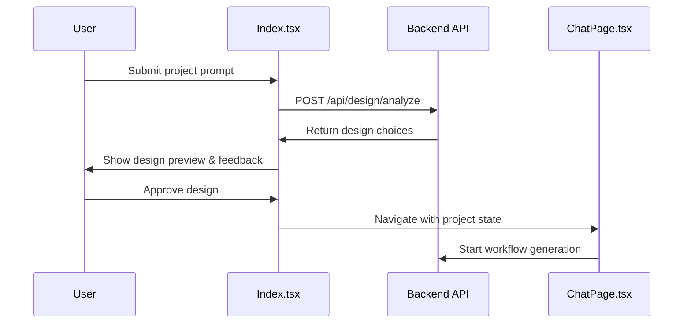
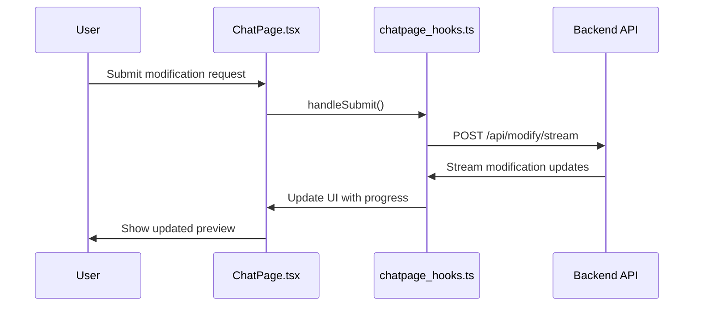

# Component Architecture Documentation

## Overview

This document provides a detailed explanation of the connection and functionality between three core components of the CodePup application:

1. **Index.tsx** - The landing page and project dashboard
2. **ChatPage.tsx** - The interactive code generation interface
3. **chatpage_hooks.ts** - Custom React hooks for state management

## File Locations

- `src/pages/Index.tsx` - Main landing page component
- `src/pages/ChatPage.tsx` - Chat interface component  
- `src/hooks/chatpage_hooks.ts` - Custom hooks for chat functionality

## Component Connections

### High-Level Flow

```
Index.tsx (Landing Page)
    ↓ (User creates project & navigates)
ChatPage.tsx (Code Generation Interface)
    ↓ (Uses custom hooks for state management)
chatpage_hooks.ts (State & Logic Management)
```

### Navigation Flow

1. **Index.tsx → ChatPage.tsx**: When users click on projects or complete the workflow
2. **State Transfer**: Project data, configuration, and context passed via React Router state
3. **Hook Integration**: ChatPage.tsx consumes custom hooks from chatpage_hooks.ts

## 1. Index.tsx - Landing Page & Project Dashboard

### Primary Responsibilities

- **Authentication Management**: Integrates with Clerk for user authentication
- **Project Dashboard**: Displays user's existing projects with previews and metadata
- **Project Creation**: Handles new project creation workflow with design analysis
- **Supabase Configuration**: Manages backend database configuration
- **Design Workflow**: Pre-generation design analysis and refinement process

### Key Features

#### Project Type Selection
- Frontend-only projects
- Full-stack projects with backend
- Scope determination for workflow routing

#### Design Analysis Workflow
```typescript
// Workflow Process
1. User submits prompt + optional images
2. System creates project with selected scope
3. Design analysis API call (/api/design/analyze)
4. Interactive feedback loop for design refinement
5. Final generation trigger to ChatPage.tsx
```

#### Project State Management
```typescript
interface Project {
  id: number;
  name: string;
  description?: string;
  deploymentUrl?: string;
  projectType?: string;
  status?: string;
  scope?: "frontend" | "fullstack";
  messageCount?: number;
}
```

#### Navigation to ChatPage
```typescript
// When user completes workflow or clicks existing project
navigate("/chatPage", {
  state: {
    projectId: project.id,
    existingProject: true,
    scope: project.scope,
    supabaseConfig: supabaseConfig,
    fromWorkflow: true, // If coming from design process
    clerkId: clerkUser?.id,
    userId: dbUser?.id,
  }
});
```

### Key Components Within Index.tsx

1. **ProjectCard**: Individual project display with previews and actions
2. **DesignPreview**: Visual design preview during workflow
3. **FeedbackInput**: User feedback collection during design process
4. **SupabaseConfigForm**: Backend configuration management

## 2. ChatPage.tsx - Interactive Code Generation Interface

### Primary Responsibilities

- **Live Code Generation**: Real-time streaming code generation with visual feedback
- **Project Modification**: Post-generation code modifications and updates
- **Live Preview**: Embedded iframe showing deployed application
- **File Management**: Display and tracking of generated files
- **Deployment Integration**: Production deployment capabilities

### Layout Structure

```
┌─────────────────────────────────────────┐
│ Chat Section (25%) │ Preview Section (75%) │
├─────────────────────┼─────────────────────┤
│ • Header            │ • Preview Header     │
│ • Workflow Progress │ • Live Preview       │
│ • Messages          │ • Code Stream        │
│ • Input Area        │ • Workflow Display   │
└─────────────────────┴─────────────────────┘
```

### State Management Integration

ChatPage.tsx uses two custom hooks from chatpage_hooks.ts:

```typescript
const state = useChatPageState();    // All state variables
const logic = useChatPageLogic(state); // All logic functions
```

### Key Features

#### Streaming Code Generation
- Real-time code streaming with visual progress
- File-by-file generation tracking
- Live progress indicators and statistics

#### Workflow Management
- Frontend-only workflow (2 steps)
- Full-stack workflow (4 steps) 
- Dynamic step progression based on project scope

#### File Upload Support
- Image uploads for design references
- Asset uploads (fonts, icons, documents)
- Dual upload modes with type validation

#### Live Preview System
- Embedded iframe with deployed application
- Enhanced refresh capabilities

#### Deployment Integration
- One-click production deployment
- Live deployment status tracking
- Automatic URL updates

## 3. chatpage_hooks.ts - State & Logic Management

### Architecture

The hooks file is split into two main exports:

1. **useChatPageState()**: Pure state management
2. **useChatPageLogic()**: Business logic and API interactions

### useChatPageState() - State Management

Manages all component state including:

```typescript
// Core states
const [messages, setMessages] = useState<Message[]>([]);
const [prompt, setPrompt] = useState<string>("");
const [isLoading, setIsLoading] = useState(false);
const [previewUrl, setPreviewUrl] = useState<string>("");

// Workflow states  
const [isWorkflowActive, setIsWorkflowActive] = useState(false);
const [currentWorkflowStep, setCurrentWorkflowStep] = useState<string>("");
const [workflowProgress, setWorkflowProgress] = useState(0);

// Streaming states
const [isStreamingGeneration, setIsStreamingGeneration] = useState(false);
const [streamingProgress, setStreamingProgress] = useState(0);
const [generatedFiles, setGeneratedFiles] = useState<GeneratedFile[]>([]);

// File upload states
const [selectedImages, setSelectedImages] = useState<File[]>([]);
const [selectedAssets, setSelectedAssets] = useState<File[]>([]);
const [uploadMode, setUploadMode] = useState<'images' | 'assets'>('images');
```

### useChatPageLogic() - Business Logic

Manages all business logic and API interactions:

#### Core Functions

```typescript
// Project Management
const loadProject = async (projId: number) => { ... }
const loadProjectMessages = async (projectId: number) => { ... }

// Workflow Management  
const startCompleteWorkflow = async (userPrompt: string, projId: number) => { ... }
const startStreamingFrontendGeneration = async (projId: number) => { ... }

// Modification System
const sendModificationRequest = async (prompt: string, images: File[], assets: File[]) => { ... }

// File Handling
const handleImageSelect = (event: React.ChangeEvent<HTMLInputElement>) => { ... }
const handleAssetSelect = (event: React.ChangeEvent<HTMLInputElement>) => { ... }
```

#### Workflow Orchestration

Based on project scope, different workflows are executed:

**Frontend Workflow (2 steps):**
1. Design Generation (50% progress)
2. Frontend Generation (streaming to 100%)

**Full-stack Workflow (4 steps):**
1. Design Generation (25% progress)
2. Structure Planning (50% progress)  
3. Backend Generation (75% progress)
4. Frontend Generation (streaming to 100%)

#### Streaming Data Processing

```typescript
const handleStreamingData = (data: StreamingProgressData, projId: number) => {
  switch (data.type) {
    case "progress": // Update progress indicators
    case "chunk":    // Process code chunks
    case "complete": // Handle completion
    case "result":   // Set final results
    case "error":    // Handle errors
  }
}
```

## Data Flow Between Components

### 1. Project Creation Flow (Index → ChatPage)



### 2. Modification Flow (ChatPage Internal)



### 3. State Sharing Pattern

```typescript
// Index.tsx - Passing state to ChatPage
const handleProjectClick = (project: Project) => {
  navigate("/chatPage", {
    state: {
      projectId: project.id,
      existingProject: true,
      scope: project.scope,
      supabaseConfig: supabaseConfig,
      // ... other state
    }
  });
};

// ChatPage.tsx - Receiving state
const location = useLocation();
const {
  projectId,
  existingProject, 
  supabaseConfig,
  scope,
  fromWorkflow
} = (location.state as LocationState) || {};

// chatpage_hooks.ts - Using received state
useEffect(() => {
  if (scope && scope !== projectScope) {
    setProjectScope(scope);
  }
}, [scope, projectScope, setProjectScope]);
```

## API Integration Points

### Backend Endpoints Used

1. **Project Management**
   - `GET /api/projects/container/{id}` - Load project details
   - `POST /api/projects` - Create new project
   - `DELETE /api/projects/{id}` - Delete project

2. **Design & Generation**
   - `POST /api/design/analyze` - Design analysis workflow
   - `POST /api/design/feedback` - Design feedback processing
   - `POST /api/design/generate` - Generate design files
   - `POST /api/design/generateFrontendOnly` - Frontend-only generation
   - `POST /api/design/generate-frontend` - Full-stack generation

3. **Modifications**
   - `POST /api/modify/stream` - Stream modifications with images
   - `POST /api/modify/assets/stream` - Stream modifications with assets

4. **Deployment**
   - `POST /api/design/build-and-deploy` - Deploy to production

## Configuration Management

### Supabase Configuration

Managed in Index.tsx and passed to ChatPage.tsx:

```typescript
interface SupabaseConfig {
  supabaseUrl: string;
  supabaseAnonKey: string; 
  supabaseToken: string;
  databaseUrl: string;
}

// Stored in localStorage and passed via navigation state
const handleSupabaseConfigSubmit = (config: SupabaseConfig) => {
  setSupabaseConfig(config);
  localStorage.setItem("supabaseConfig", JSON.stringify(config));
};
```

## Error Handling & Recovery

### Server Health Management

```typescript
// In chatpage_hooks.ts
const checkServerHealth = async () => {
  try {
    const response = await axios.get(`${baseUrl}/health`);
    setIsServerHealthy(true);
    return true;
  } catch (error) {
    setIsServerHealthy(false);
    setError("Backend server is not responding");
    return false;
  }
};
```

### Retry Mechanisms

- Automatic server health checking
- Manual retry buttons for failed operations  
- Graceful degradation when backend is unavailable
- Connection restoration capabilities

## Performance Optimizations

### Streaming Optimizations

1. **Chunk Processing**: Throttled processing to prevent UI blocking
2. **Queue Management**: Asynchronous processing queue for code chunks
3. **Memory Management**: Cleanup of processing queues and accumulated content

### React Optimizations

1. **Memoized Components**: ProjectCard, DesignPreview components are memoized
2. **Callback Optimization**: useCallback for expensive operations
3. **State Batching**: Efficient state updates during streaming

## Security Considerations

### File Upload Security

```typescript
// File type validation
const validTypes = [
  'image/jpeg', 'image/png', 'image/gif', 'image/webp',
  'application/pdf', 'text/plain', 'application/json'
];

// Size limits
const maxImageSize = 5 * 1024 * 1024; // 5MB for images
const maxAssetSize = 10 * 1024 * 1024; // 10MB for assets
```

### Authentication Integration

- Clerk authentication throughout the application
- User ID validation before API calls
- Session management with automatic refresh

## Future Extension Points

### 1. Real-time Collaboration
- The streaming infrastructure can be extended for multi-user collaboration
- Message broadcasting for team workspaces

### 2. Enhanced File Management
- File versioning system
- Direct file editing capabilities
- Git integration for version control

### 3. Advanced Deployment Options
- Multiple deployment targets (AWS, Netlify, etc.)
- Environment-specific configurations
- Automated testing integration

## Troubleshooting Guide

### Common Issues

1. **Navigation State Loss**: Ensure state is properly passed in navigation
2. **Streaming Interruption**: Check network connectivity and server health
3. **File Upload Failures**: Verify file types and size limits
4. **Preview Not Loading**: Check deployment URL and iframe permissions

### Debug Information

Enable debug logging in development:

```typescript
// In chatpage_hooks.ts
console.log("🔍 ChatPage State Update:", {
  fromWorkflow,
  projectId, 
  isWorkflowActive,
  isStreamingGeneration,
  workflowStepsCount: workflowSteps.length
});
```

This architecture provides a robust, scalable foundation for the CodePup application with clear separation of concerns and efficient state management.